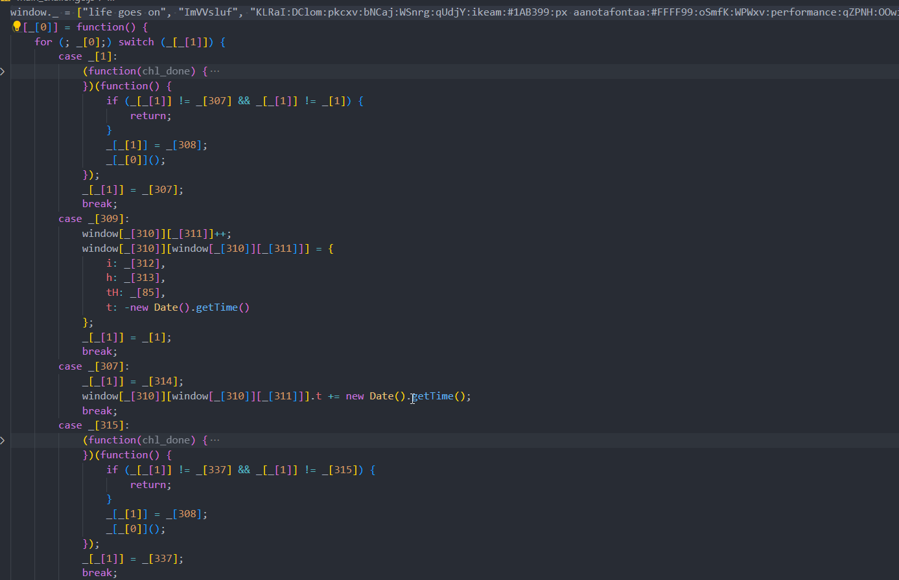
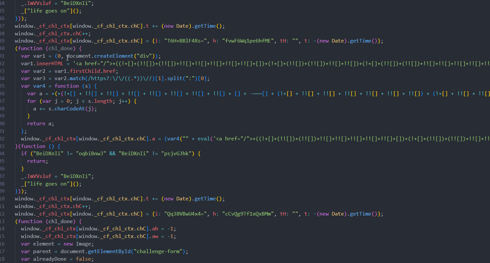

# Cloudflare Deobfusactor

A dynamic deobfuscator for cloudflare's antibot javascript challenge


**Before**




**After**


## Features
1) Unconceals String Conceals

```js
c('0x19e')

// output

"length"

```

2) Unflattens Control Flow Flattening Protection
```js
_[_[1]] = _[2]


for (; _[0];) switch (_[_[1]]) {
        case _[2]:
            console.log("2")
            return


        case _[1]:
            console.log("1")
            _[_[1]] = _[2]
            break
        

}
// output

"1"
"2"

```
3) Simplifies Proxy Binary Functions
```js
WEGiQ = function (I, J) {
      return I + J;
    }
WEGiQ(d._cf_chl_opt.cRay, "_")

// Simplifies to 
d._cf_chl_opt.cRay + "_"


```

## Usage

Change the index.ts to the specific cloudflare script you're trying to deobfuscate

```js
import { Deobfusactor } from "./deobfuscator";

import fs from 'fs';
const src = fs.readFileSync('input/challenge.js').toString()


const session = new Deobfusactor(src)


session.deobfuscateInitChallenge()


fs.writeFileSync("output.js", session.$script.codegen()[0])
```


```bash
npm install
npm start
```